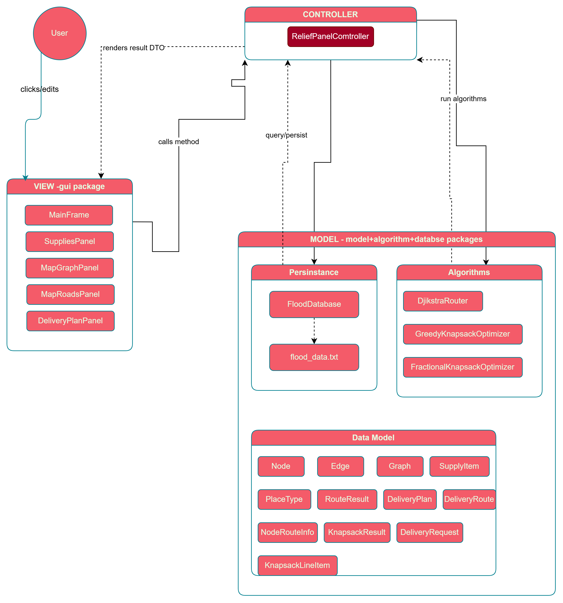

# Flash Flood Relief Logistic Optimization in Selangor - CCS4202 Group Project

Managing flood risk information across multiple zones can be overwhelming. Flash Flood Tracker brings clarity to real-time flood data with organized dashboards and automated alerts. There is also a feature that analyze the best combination of supply based on its weight and value that need to be transported to affected victims. It is a time saving since during disaster time, many unexpected events can be happen.

## Table of Contents

- [Problem Statement](#problem-statement)
- [Our Solution](#our-solution)
- [Core Features](#core-features)
- [Architecture](#architecture)
- [Tech Stack](#tech-stack)
- [How to Install and Run](#how-to-install-and-run)
- [Team](#team)

## Problem Statement

Flash floods are among the most dangerous natural disasters. Without early warning systems, communities cannot respond fast enough to protect lives and property. Then, our group, AZIS invented a project to help solve this issue. We build a computer system that turns the disaster areas into a graph that consist of node that represent places and edges represent roads. We apply 3 algorithm to solve the problems at the same time. This system was trained to find a shortest route  to each location and choosing the best combination of supplies to load into a rescue truck without exceeding the weight limit. Model-View-Contoller(MVC) structure is applied in the system, so the logic part and interface part are being split and more manageable. 

## Our Solution

-Convert a disaster area as a directed weighted graph, where the nodes are locations and edges are roads with travel time as weight.
-Use Dijkstra’s Algorithm to find the shortest distance and safest route from base area to affected areas, if a certain road is block, the Dijkstra’s Algorithm will find another shortest and safest route.
-Implementing Fractional Knapsack Algorithm to choose the best combination of supplies that can be split into smaller parts because we want to used a truck capacity as fully as possible.

## Core Features
1) Map and Roads
.png)
- Add Place > Can be used to add new place in the map to deliver the emergency supplies
- Delete Selected > Can delete the selected place in the map
- Add Road > Can connect between 2 places, also can add the flood depth and expected travel time
-Additional info:
- The table below map shows the route based on the map,estimated travel time, limit supply that can be carried on and check box to determine whether the road is flooded or not
- The straight line connecting edges means that the route is not affected by flood, but if the line conneceted between 2 edges is dotted, the route is affected by flood.

2) Supplies
.png)
- This UI shows the list of supplies,its weight,priority score and available stock
- There is also feature to add and remove item at bottom left

3) Delivery Plan
.png)
- This UI shows information about delivery plan
- It is mainly to show the information about the transportation of supply from UPM (main base) and UNITEN (sub base) to the affected area

## Architecture
The project follows a clean MVC (Model-View-Controller) pattern:

- GUI > Renders all panels and user interactions using Java Swing
- Controller > Single entry point for all business logic; calls algorithms and database
- Algorithm > Stateless implementations of Dijkstra, Fractional Knapsack, and Greedy Knapsack
- Database > Manages the in-memory graph and supply list; reads/writes flood_data.txt
- Model > Pure data classes — no logic, no dependencies

  ## Tech Stack
- Language > Java (JDK 11+)
- GUI Framework > Java Swing
- Build / IDE > IntelliJ IDEA (.iml project)
- Routing Algorithm > Dijkstra's Shortest Path
- Optimisation Algorithm > Fractional Knapsack + Greedy Knapsack
- Persistence > Flat-file (flood_data.txt, CSV-style)
- Dependencies > None — pure Java standard library

## Project Structure

## Project Structure

Group-Project-CCS4202-Flash-Flood/
├── flood_data.txt                           # Persistent data file (auto-generated)
├── src/
│   ├── gui/
│   │   ├── Main.java                        # Entry point — wires DB, controller, and window
│   │   ├── MainFrame.java                   # Root Swing window with tabbed navigation
│   │   ├── MapGraphPanel.java               # Interactive map canvas (nodes + edges)
│   │   ├── MapRoadsPanel.java               # Road/edge management panel
│   │   ├── SuppliesPanel.java               # Supply inventory editor
│   │   └── DeliveryPlanPanel.java           # Delivery request builder + plan results view
│   │
│   ├── controller/
│   │   └── ReliefPlannerController.java     # Core MVC controller
│   │
│   ├── algorithm/
│   │   ├── DijkstraRouter.java              # Shortest path with flood/weight/time constraints
│   │   ├── FractionalKnapsackOptimizer.java # Optimal fractional supply loading
│   │   └── GreedyKnapsackOptimizer.java     # Whole-unit greedy supply loading
│   │
│   ├── database/
│   │   └── FloodDatabase.java               # Graph + supply store; file I/O
│   │
│   └── model/
│       ├── Graph.java                       # Adjacency-list graph
│       ├── Node.java                        # Location (hub or affected area)
│       ├── Edge.java                        # Road with travel time, weight limit, flood depth
│       ├── SupplyItem.java                  # Relief item with weight and priority
│       ├── DeliveryPlan.java                # Full output of one planning run
│       ├── DeliveryRoute.java               # Single hub-to-destination result
│       ├── DeliveryRequest.java             # User-defined routing request
│       ├── NodeRouteInfo.java               # Per-node: ETA, path, reachability flag
│       ├── KnapsackResult.java              # Output of a knapsack optimisation
│       ├── KnapsackLineItem.java            # Single item in a knapsack solution
│       ├── PlaceType.java                   # Enum: RELIEF_HUB | AFFECTED_AREA
│       └── RouteResult.java                 # Wrapper for Dijkstra results map / all nodes
│
├── image/
│   ├── Project banner.png
│   ├── UI(1).png
│   ├── UI(2).png
│   └── UI(3).png
│
└── out/                                     # Compiled .class files (auto-generated by IDE)

  ## How to Install and Run
  **Prerequisites**
  - Java JDK 11 or higher installed (Download here)
  - IntelliJ IDEA (recommended) — or any Java IDE / the command line

**Option 1 — Run in IntelliJ IDEA**
1. Clone or donwload this repository:
   git clone https://github.com/<your-username>/Group-Project-CCS4202-Flash-Flood.git
2. Open the project in IntelliJ IDEA:
File → Open → select the project folder
3. Set the SDK if prompted:
File → Project Structure → Project SDK → choose JDK 11+
4. Run the application:
- Navigate to src/gui/Main.java
- Click the green ▶️ Run button next to the main method
Or right-click the file → Run 'Main.main()'

**Option 2 — Run from the Command Line**
1. Compile all source files from the project root: javac -d out/production/Group-Project-CCS4202-Flash-Flood src/**/*.java (On Windows CMD, replace src/**/*.java with explicit paths or use a wildcard-compatible shell)
2. Run the compiled application: java -cp out/production/Group-Project-CCS4202-Flash-Flood gui.Main
3. First Launch Behaviour

On first run, the app automatically loads a Selangor sample dataset with:
- 2 relief hubs: UPM and UNITEN
- 6 affected areas: SK Sri Serdang, SMK Sri Serdang, Univ 360, KTMB, SK Sungai Merab, SMK Sungai Ramal
- Pre-configured roads with flood depth data
- 6 relief supply items (Medical Kit, Clean Water, Infant Formula, Rice Ration, Torch+Battery, Blanket)
This data is saved to flood_data.txt in the project root and reloaded on subsequent launches.
  
  ## Team

| Name | Role |
| --- | --- |
| [MUHAMMAD ADAM SAFWAN BIN BAHTIAR](https://github.com/masafwan2005-maker) | Team Leader|
| [MUHAMMAD AIMAN HAFIY BIN MOHD NIZAM](https://github.com/aimanhafiy7) | Analyst |
| [ISMAIL BIN BAKHTIAR](https://github.com/joiboi56) | Developer |
| [WAN ZUHAILI AFIQ BIN WAN MOHD ZAIDI](https://github.com/WanZuhai) | Documentation Lead |
